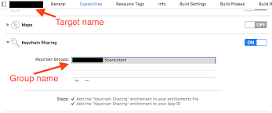

# Configuration

It is recommended to use the latest version of Android Studio and Xcode to ensure compatibility with the latest Android and iOS SDKs

Both Android and iOS have some configuration to ensure that the library works properly.


## Android Configuration

1. Add proguard rules:
   Create or update `android/app/proguard-rules.pro`:

   ```
   -if class androidx.credentials.CredentialManager
   -keep class androidx.credentials.playservices.** {
     *;
   }
   ```

2. Update `android/app/build.gradle`:

   ```gradle
   android {
     buildTypes {
       release {
         minifyEnabled true
         proguardFiles getDefaultProguardFile('proguard-android-optimize.txt'), 'proguard-rules.pro'
       }
     }
   }
   ```

## iOS Configuration


For iOS, it uses [Keychain](https://developer.apple.com/documentation/security/keychain_services) for storing passkeys and [Autofill](https://developer.apple.com/documentation/uikit/text_input/adding_password_autofill_support_to_your_app) for managing credentials.


Password autofill feature introduced with iOS 11 is supposed to ease the process of account creation and login for iOS apps. It received a major update with iOS 12 that brought new tag fields, security code autofill, strong password recommendations, and many other significant changes. It even provides credentials from third-party password managers when enabled.

### Enabling Password AutoFill

To enable password autofill, we need to setup Associated Domains in Xcode. 
Read more about [Associated Domains](https://developer.apple.com/documentation/xcode/supporting-associated-domains-in-your-app).    


### Associated Domains  

1. Open your project in Xcode.
2. Navigate to your app's target and select the "Signing & Capabilities" tab.
3. Click on the "+" button to add a new capability and select "Associated Domains".
4. In the Associated Domains section, add the domain that you want to associate with your app using the format `applinks:yourdomain.com` and `webcredentials:yourdomain.com`.   


5. Ensure that your website has an `apple-app-site-association` file at the root, which contains the app identifiers and paths that should be associated with your app.

```json
{   
  "applinks": {
    "apps": [],
    "details": [{
      "appIDs": ["<team_id>.com.yourappname"]
    }]
  },
  "webcredentials": {
    "apps": [
      "<team_id>.com.yourappname"   
    ]
  }
}
```
6. Validate the `apple-app-site-association` file by hosting it at `https://yourdomain.com/.well-known/apple-app-site-association` and use the [Branch AASA Validator](https://branch.io/resources/aasa-validator/) to validate the file or by making GET request to your domain.

```sh
curl -X GET https://yourdomain.com/.well-known/apple-app-site-association
```

### Keychain group

- Add a new capability to your app's target and select "Keychain Sharing".
- In the "Keychain Sharing" section, add the keychain group name that you want to share across your app and other apps from the same team.

  


This setup allows iOS to recognize your app as capable of handling specific links and enables the password autofill feature and as well as [passkeys](https://developer.apple.com/documentation/localauthentication/password_autofill/about_passkeys).


