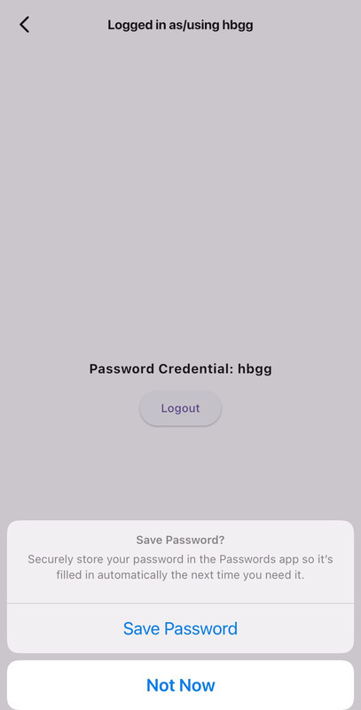

# Usage
Let's see how to use Credential Manager in your app and how to integrate it with other services including Google Sign-In,Passkey and Password based authentication.

## Initialize Credential Manager

- Create an instance of **CredentialManager** object.

```dart
final CredentialManager credentialManager = CredentialManager();
```

- Check if the platform is supported by calling `isSupportedPlatform` property of **CredentialManager** object.

```dart
if (credentialManager.isSupportedPlatform) {
  // Platform is supported, initialize the manager
}
```


- Initialize the manager with the required parameters.

```dart
await credentialManager.init(
  preferImmediatelyAvailableCredentials: true,
);
``` 
> **Note:** The `preferImmediatelyAvailableCredentials` parameter is optional. When set to `true`, it tells the authorization controller to prefer credentials that are immediately available on the local device. If not provided, it defaults to `false`, and it will try to fetch the credentials from the platform's native APIs.

## Password Based Credentials

Mechanism of storing and retrieving password based credentials in android uses native APIs of [Credential Manager](https://developer.android.com/jetpack/androidx/releases/credentials) and for iOS it uses autofill service which use keychain to store the credentials.


### Android


- Saving Credentials


```dart
try {
  await credentialManager.savePasswordCredential(
    PasswordCredential(
      username: '1234567890',
      password: 'password',
    ),
  );
} on CredentialException catch (e) {
  // Handle the error
  print('Error saving password credential: ${e.message}');
}
```

- Retrieving Credentials

```dart
try {
  Credentials credential = await credentialManager.getCredentials(
        fetchOptions: FetchOptionsAndroid(
          passwordCredential: true
        ),
      );
} on CredentialException catch (e) {
  // Handle the error
}
``` 

- Handling Response
Credentials object will have one of the following properties based on the type of credential that is available, as of now only password so rest of the properties will be null.

```dart
if (credential.passwordCredential != null) {
  // Handle password credential
  print('Username: ${credential.passwordCredential!.username}');
  print('Password: ${credential.passwordCredential!.password}');
} else if (credential.publicKeyCredential != null) {
  // Handle passkey credential
  print('Passkey ID: ${credential.publicKeyCredential!.id}');
  print('Passkey Raw ID: ${credential.publicKeyCredential!.rawId}');
} else if (credential.googleIdTokenCredential != null) {
    // Handle Google ID token credential
  print('Google ID Token: ${credential.googleIdTokenCredential!.email}');
} else {
  // Handle case where no credentials are available
  print('No credentials available');
}
```

### iOS


- Saving Credentials

Wrap the textfield with of **username** and **password** with `AutofillGroup` widget.

```dart
AutofillGroup(
  child: Column(
    children: [
    TextFormField(
      autofillHints: const [AutofillHints.username],
      decoration: const InputDecoration(
        labelText: 'Username',
      ),
    ),
    TextFormField(
      autofillHints: const [AutofillHints.password],
      decoration: const InputDecoration(
        labelText: 'Password',
      ),
      obscureText: true,
    ),
    ],
  ),
);
``` 

- Now validate the credentials and after action, Native APIs will handle the rest of the things.




- Retrieving Credentials

It will popup keychain access prompt on *   *keyboard** when user starts typing in the textfield with autofill hint as **password** and **username**.

 


## Google Sign-In (Only For Android)

Follow these steps to set up Google Sign-In for your application:

### Setup Google Cloud Console
1. **Access Google Cloud Console**
   - Visit the [Google Cloud Console](https://console.cloud.google.com/)

2. **Create or Select a Project**
   - Create a new project or select an existing one

3. **Configure OAuth Consent Screen**
   - In the left sidebar, navigate to "APIs & Services" > "OAuth consent screen"
   - Choose the user type (External or Internal)
   - Fill in the required information and save

4. **Create Credentials**
   - In the left sidebar, go to "APIs & Services" > "Credentials"
   - Click the "Create Credentials" button and select "OAuth client ID"

5. **Set Application Type**
   - For Android apps, choose "Android" as the Application Type

6. **Configure Android App**
   - Enter your app's package name
   - Obtain the SHA-1 certificate fingerprint:
     ```sh 
     cd android && ./gradlew signingReport
     ```
     or use `keytool` command:
     ```sh
     keytool -list -v -keystore ~/.android/debug.keystore -alias androiddebugkey -storepass android -keypass android
     ```
   - Add the SHA-1 fingerprint to the Google Cloud Console

7. **Create Web Application Credentials**
   - Go back to the Credentials page
   - Click "Create Credentials" > "OAuth client ID" again
   - Select "Web application" as the Application Type
   - You can leave "Authorized JavaScript Origins" and "Authorized redirect URIs" blank for now
   - Click "Create"


8. **Obtain Client ID**
   - After creation, copy the "Client ID" for the web application.

9. **Set Client ID in Credential Manager**

```dart
await credentialManager.init(
  googleClientId: '<your-web-client-id>',
);
```

### Sign-In with Google

- Sign up using Google account and then you will be able to see the saved credentials in the app.

```dart
try{
    final GoogleIdTokenCredential credential = await credentialManager.saveGoogleCredential(
        useButtonFlow: false
      );

} on CredentialException catch (e) {
    // Handle the error
    print('Error saving Google credential: ${e.message}');
}
      
```
[GoogleIdTokenCredential](https://pub.dev/documentation/credential_manager/latest/credential_manager/GoogleIdTokenCredential-class.html) object will have the following properties:

```dart
print('Google ID Token: ${credential.email}');
```

> **Note:** `useButtonFlow` is `true` is traditional google sign in alert dialog flow and `false` is new google one tap sign in flow with Credential Manager UI.

- With using `useButtonFlow`


- Without using `useButtonFlow`


- Getting Google Sign-In Account    


```dart
try{
    Credentials credential = await credentialManager.getCredentials(
        fetchOptions: FetchOptionsAndroid(
        googleCredential: true
        ),
      );
  //check if credential is not null
  if (credential.googleIdTokenCredential != null) {
    print('Google Email: ${credential.googleIdTokenCredential!.email}');
  }
} on CredentialException catch (e) {
    // Handle the error
    print('Error getting Google credential: ${e.message}');
}   
``` 


## Passkey

For iOS, we have nothing extra to do apart from hosting Apple Site Association File on your server,which is also required for this plugin to work in **iOS**.

PassKey support for **Android** is after **Android 14+** and Only **iOS 16+** and above and other platforms are not supported yet and sdk will throw error if you try to use it on those platforms.


### Passkey Setup for Android

1. Create a Digital Asset Links JSON file (assetlinks.json):
   - Open a text editor and create a new file named `assetlinks.json`.
   - Paste the following content into the file, replacing the placeholders with your specific information:

   ```json
   [
     {
       "relation": [
         "delegate_permission/common.handle_all_urls",
         "delegate_permission/common.get_login_creds"
       ],
       "target": {
         "namespace": "android_app",
         "package_name": "com.example.android",
         "sha256_cert_fingerprints": [
           "SHA_HEX_VALUE"
         ]
       }
     }
   ] 
   ```

2. Host the Digital Asset Links JSON file:
   - Place the file at the following location on your sign-in domain:
     `https://domain[:optional_port]/.well-known/assetlinks.json`

3. Configure your host:
   - Ensure that your host permits Google to retrieve your Digital Asset Link file.
   - If you have a `robots.txt` file, it must allow the Googlebot agent to retrieve `/.well-known/assetlinks.json`.
   - Most sites can use the following configuration:

   ```
   User-agent: *
   Allow: /.well-known/
   ```


### Create Passkey Credentials


- [CredentialCreationOptions](https://pub.dev/documentation/credential_manager/latest/credential_manager/CredentialCreationOptions-class.html) is a class that is used to create passkey credentials. It has many optional parameters to customize the passkey creation process depending on your requirement and platform support.

- Here is an example of how to create passkey credentials with default options.

```dart
final credentialCreationOptions = {
          "challenge": "HjBbH__fbLuzy95AGR31yEARA0EMtKlY0NrV5oy3NQw",
          "rp": {"name": "CredMan App Test", "id": rpId},
          "user": {
            "id": EncryptData.getEncodedUserId(),
            "name": username,
            "displayName": username,
          },
          "excludeCredentials": [
            {"id": "ghi789", "type": "public-key"},
            {"id": "jkl012", "type": "public-key"}
          ],
        };
        //add platform specific options

        if (Platform.isAndroid) {
          credentialCreationOptions.addAll({
            "pubKeyCredParams": [
              {"type": "public-key", "alg": -7},
              {"type": "public-key", "alg": -257}
            ],
            "timeout": 1800000,
            "attestation": "none",
            "authenticatorSelection": {
              "authenticatorAttachment": "platform",
              "residentKey": "required",
              //required for android
              "userVerification": "required"
            }
          });
        }
```
- Call `savePasskeyCredentials` method of **CredentialManager** object with `credentialCreationOptions` as parameter.   

```dart
final PublicKeyCredential credential = await credentialManager.savePasskeyCredentials(
    request: CredentialCreationOptions.fromJson(credentialCreationOptions),
);
``` 


[PublicKeyCredential](https://pub.dev/documentation/credential_manager/latest/credential_manager/PublicKeyCredential-class.html) object will have the following properties:

```dart
print('Passkey ID: ${credential.id}');
print('Passkey Raw ID: ${credential.rawId}');
```


### Get Passkey Credentials

- Call `getCredentials` method of **CredentialManager** object with `fetchOptions` parameter set to `FetchOptionsAndroid(passKey: true)` for Android and iOS it will automatically fetch the passkey credentials without `fetchOptions` parameter and also it required payload data to for getting passkey credentials `CredentialLoginOptions` which is discussed below as following perameter 
` passKeyOption: CredentialLoginOptions()`.

> **Note:** `CredentialLoginOptions` is optional peramter for android if you not want to fetch passkey credentials but if you want fo fetch passkey credentials then you have to provide `CredentialLoginOptions` as parameter otherwise it will throw error it both platform.


- Here is an example of how to get passkey credentials.


```dart
var passKeyLoginOption = CredentialLoginOptions(
      challenge: "HjBbH__fbLuzy95AGR31yEARA0EMtKlY0NrV5oy3NQw",
      rpId: rpId,
      userVerification: "required",
      //only for ios, true only when we want to show the passkey popup on keyboard otherwise false
      conditionalUI: false,
    ); 
```
> **Note:** `rpId` is the relying party ID which is your domain name. and `challenge` is a challenge string that the authenticator must complete and it should be base64url encoded string and userVerification is optional parameter in **iOS** and **Android** it defaults to `required` if not provided. and `conditionalUI` is only for **iOS** it defaults to `false` if not provided which gives hint passkey popup on keyboard.

Read more about [CredentialLoginOptions](https://pub.dev/documentation/credential_manager/latest/credential_manager/CredentialLoginOptions-class.html) for more details.

- Now call `getCredentials` method with `passKeyLoginOption` as parameter.

```dart
try{
    Credentials credential = await credentialManager.getCredentials(
    passKeyOption: passKeyLoginOption,
    fetchOptions: FetchOptionsAndroid(
        passKey: true
    ),
);
//handle response
if(credential.publicKeyCredential != null){
  print('Passkey ID: ${credential.publicKeyCredential!.id}');
        print('Passkey Raw ID: ${credential.publicKeyCredential!.rawId}');
    }  
} on CredentialException catch (e) {
    // Handle the error
    print('Error getting passkey credential: ${e.message}');
} 
```     


## Logout 
It works only on Android and it will clear all the saved credentials from session.

```dart
    await credentialManager.logout();
```
More about [logout](https://pub.dev/documentation/credential_manager/latest/credential_manager/CredentialManager/logout.html) method.   


 


